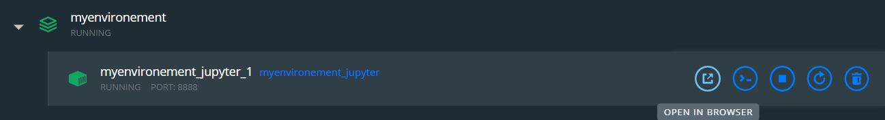

# データ分析環境の構築（非GPU）
データ分析用の環境構築がすぐできるようにメモ

## 前提
- OS: Windows 10
- WSL のインストールが完了している

    ```
    C:\Users\eX>wsl -l -v /// コマンドプロンプトで
    NAME                   STATE           VERSION
    * Ubuntu-20.04           Running         2
    ```

- Docker for Windows のインストールが完了
    ```
    $ docker --version
    Docker version 20.10.5, build 55c4c88
    $ docker-compose --version
    docker-compose version 1.29.0, build 07737305

## コンテナを起動する 
WSL のコンソールを立ち上げて、以下のコマンドを実行

```$ docker-compose up --build```

## notebook にアクセスする
Docker for Windows の コンテナ一覧にある"myenvironement" の OPEN IN BROSER から notebook にアクセスできる
（初回のみWSLのコンソール上に表示される token の入力を求められる）
 

## 参考

1. [Dockerでデータ分析環境を手軽に作る方法](https://amalog.hateblo.jp/entry/data-analysis-docker)

2. [Kaggle 公式](https://github.com/Kaggle/docker-python)

## Todo
- jupyter lab にしたい
- Windows 側のフォルダへのアクセスをさっとできるようにしたい
- Container machine のスペック設定を変えたい
